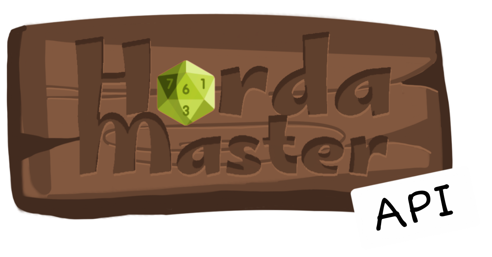

<div align="center">
  
</div>

# HordaMaster API

A HordaMaster API foi desenvolvida em Flask para gerenciar fichas de inimigos em jogos de RPG. A API permite criar, visualizar, atualizar e excluir fichas e seus respectivos cartões de combate, facilitando a organização e controle de grandes grupos de adversários.

## 🎯 Propósito
Este projeto faz parte da minha pós-graduação em desenvolvimento full-stack e foi criado com o objetivo de aprimorar habilidades práticas em backend, além de oferecer uma solução útil para a comunidade de RPG.

Para a interface visual e gerenciamento dos dados no frontend, confira o repositório do [HordaMaster](https://github.com/maisepmaya/front-end-puc-rio-project.git).

## 🚀 Tecnologias utilizada

- Python 
- SQLite
- Flask

## 🔧 Como executar

1. Clone o projeto:
```
  git clone https://github.com/maisepmaya/back-end-puc-rio-project.git
```

2. Após clonar o repositório, é necessário ir ao diretório raiz, pelo terminal, para poder executar os comandos descritos abaixo.
> É fortemente indicado o uso de ambientes virtuais do tipo [virtualenv](https://virtualenv.pypa.io/en/latest/installation.html).


3. Instale as as dependências/bibliotecas descritas no arquivo requirements.txt:
```
(env)$ pip install -r requirements.txt
```

4. Para executar a API, rode o projeto com o flask:

```
(env)$ flask run --host 0.0.0.0 --port 5000
```

Em modo de desenvolvimento é recomendado executar utilizando o parâmetro reload, que reiniciará o servidor
automaticamente após uma mudança no código fonte. 

```
(env)$ flask run --host 0.0.0.0 --port 5000 --reload
```

5. Agora basta abrir o navegador e acessar: [http://localhost:5000/#/](http://localhost:5000/#/).

## ⚔️ Funcionalidades

#### Gerenciamento de Fichas

- **Criar uma nova ficha** → POST /sheet/create
- **Remover uma ficha** → DELETE /sheet/delete
- **Listar todas as fichas** → GET /sheet/getAll


#### Gerenciamento de Cartões
- **Criar um novo cartão** → POST /card/create
- **Remover um cartão** → DELETE /card/delete
- **Remover todos os cartões** → DELETE /card/deleteAll
- **Atualizar um cartão** → PUT /card/update
- **Listar todos os cartões** → GET /card/getAll


## 📖 Documentação da API HordaMaster

### Criar uma nova ficha

```http
POST /sheet/create
```

| Parâmetro  | Tipo     | Descrição                                         |
|------------|---------|-----------------------------------------------------|
| `name`     | `string` | Nome da ficha (único).           |
| `level`    | `int`    | Nível do inimigo.                 |
| `life`     | `int`    | Pontos de vida da ficha.         |
| `ac`       | `int`    | Classe de armadura da ficha.     |
| `icon`     | `string` | URL do ícone da ficha.                 |
| `info`     | `string` |Informações adicionais sobre a ficha. |

**Respostas:**
- `200 OK`: Retorna a ficha criada.
- `409 Conflict`: Nome da ficha já cadastrado.
- `400 Bad Request`: Erro inesperado.

---

### Remover uma ficha

```http
DELETE /sheet/delete
```

| Parâmetro | Tipo     | Descrição                                  |
|-----------|---------|--------------------------------|
| `id`     | `string` | ID da ficha a ser removida. |

**Respostas:**
- `200 OK`: Confirma a remoção da ficha e seus cartões.
- `404 Not Found`: Ficha não encontrada.

---

### Retornar todas as fichas

```http
GET /sheet/getAll
```

**Respostas:**
- `200 OK`: Lista de fichas armazenadas ou objeto vazio `{}` se não houver fichas.
- `400 Bad Request`: Erro inesperado.

---

### Criar um novo cartão

```http
POST /card/create
```

| Parâmetro  | Tipo     | Descrição                                        |
|------------|---------|--------------------------------------------------|
| `sheet_id` | `string` |ID da ficha associada.        |
| `index`    | `int`    |Índice do cartão.             |

**Respostas:**
- `200 OK`: Retorna o cartão criado e detalhes da ficha associada.
- `404 Not Found`: Ficha não encontrada.
- `409 Conflict`: Cartão já existente.
- `400 Bad Request`: Erro inesperado.

---

### Remover um cartão

```http
DELETE /card/delete
```

| Parâmetro | Tipo     | Descrição                                  |
|-----------|---------|--------------------------------|
| `id`     | `string` | ID do cartão a ser removido. |

**Respostas:**
- `200 OK`: Confirma a remoção do cartão.
- `404 Not Found`: Cartão não encontrado.
- `400 Bad Request`: Erro inesperado.

---

### Remover todos os cartões

```http
DELETE /card/deleteAll
```

**Respostas:**
- `200 OK`: Confirma a remoção de todos os cartões.
- `400 Bad Request`: Erro inesperado.

---

### Atualizar um cartão

```http
PUT /card/update
```

| Parâmetro  | Tipo     | Descrição                                       |
|------------|---------|----------------------------------------------|
| `id`      | `string` | ID do cartão a ser atualizado.  |
| `index`   | `int`    | Novo índice do cartão.              |
| `currLife`| `int`    | Nova vida atual do cartão.          |
| `info`    | `string` | Novas informações sobre o cartão. |

**Respostas:**
- `200 OK`: Retorna o cartão atualizado.
- `404 Not Found`: Cartão não encontrado.
- `400 Bad Request`: Erro inesperado.

---

### Retornar todos os cartões

```http
GET /card/getAll
```

**Respostas:**
- `200 OK`: Lista de cartões armazenados ou objeto vazio `{}` se não houver cartões.
- `400 Bad Request`: Erro inesperado.

## 📂 Estrutura do Projeto

``` bash
/
├── app.py            # Arquivo principal da aplicação
├── model/            # Modelos do banco de dados
├── schemas/          # Definição dos esquemas de entrada/saída
├── requirements.txt  # Lista de dependências do projeto
└── README.md         # Documentação do projeto
```

